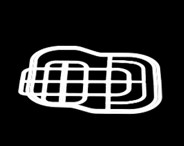
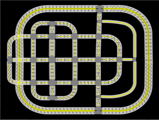

## OpenDrive Parser

Nonad正在找工作，如果您认为这个项目仓库起到了一点微小的作用，还望不吝star，感谢您为Nonad提供的助力！

Nonad is looking for a job. If you think this project repository can help a little, please light a star to encourage Nonad. Thank you :)

### 1. Function
* 解析并可视化OpenDrive地图文件中的车道线
  * 包含颜色、实虚线、宽度等信息
  * 支持以线段-两点格式输出结果
* 解析并可视化OpenDrive地图文件中的可行驶区域
* Parse and visualize lane lines in OpenDrive map files
  * Contains color, solid dotted line, width and other information
  * Support output results in line segment - two point format
* Parse and visualize the area around the ego-car in the OpenDrive map file




### 2. Dependency
* `pip install tqdm easydict matplotlib numpy opencv-python`


### 3.Drivable scope & Lane segments
主要流程
1. 解析xodr文件，初始化各采样点坐标；
2. 设置自车信息，包括xyz坐标、hdg自车朝向弧度(正数顺时针负数逆时针)、scope半径（米）、theta曲线分段夹角弧度阈值、z_lim高程上加下减阈值（米）和quality放缩系数。
quality所表达的意义如下，原始地图坐标个位数单位为米，则小数点后1位为分米，以此类推，那么蒙版每移动1像素所代表的距离单位为
（quality*原始地图坐标）的个位数所代表的单位。其中，scope半径默认为50，theta默认为0.05（约0.3度），z_lim默认为5（国内某一市极限坡度12%），quality默认为1e2；
3. 进行scope内的车道线分段，同时记录出现在scope内（包括高程范围内）的道路。对于junction道路，需要车道坐标在xy平面上包含于scope，
且z方向上在（自车z坐标±z_lim）内。对于非junction道路，需要车道线坐标在xy平面上包含于scope，且z方向上在（自车z坐标±z_lim）内。注意，车道线分段结果给出的端点坐标以自车坐标为原点；
4. 进行scope地图初始化，创建全图长宽±1.5倍scope半径尺寸的画布，以1.5倍scope半径偏移坐标绘制上一步记录的在scope内出现过的道路；
5. 在上一步所绘地图上取scope方框的边分别平行于xy轴的外接矩形（由于车头朝向），二值化后进行旋转（使车头朝向向上）和贴合scope框的裁剪，将值为255的像素点置为1。

如果需要查看蒙版图片，需要在OpenDriveLibrary/__init__.py中对206/215行取消注释

Main process
1. Parse the xodr file and initialize the coordinates of each sampling point;
2. Set the self-drive information, including xyz coordinates, hdg self-drive direction radian (positive number clockwise and negative counterclockwise), scope radius (m), theta curve segment Angle radian threshold, z_lim elevation plus minus minus threshold (m) and quality reduction coefficient.
The meaning expressed by quality is as follows: the unit of units in the original map coordinates is meters, then 1 place after the decimal point is decimeter, and so on, then the distance unit represented by each pixel moved by the mask is the unit represented by the units in the [quality* original map coordinates]. The default scope radius is 50, the default theta is 0.05 (about 0.3 degrees), the default z_lim is 5, and the default quality is 1e2.
3. Segment lane lines within scope, and record roads appearing within scope (including elevation range). For junction roads, lane coordinates need to be included in scope in the xy plane and within (Z-coordinate ±z_lim) in the z direction. For non-junction roads, lane line coordinates need to be included in scope in the xy plane and within (Z-coordinate ±z_lim) in the z direction. Note that the end coordinates given by the results of lane segmentation take the self-driving coordinates as the origin;
4. Initialize the scope map, create a canvas with the overall length and width of ±1.5 times the scope radius, and draw the roads recorded in the previous step within the scope with the offset coordinates of 1.5 times the scope radius;
5. On the map drawn in the previous step, take the edges of the scope box parallel to the external rectangle of the xy axis (due to the front facing), rotate the scope box after binarization (so that the front facing upward) and cut the scope box, and set the pixel with the value of 255 as 1.

If you want to view the mask image, you need to uncomment line 206/215 in OpenDriveLibrary/__init__.py


### 4.Examples
```text
map_parser = MapParser(xodr_file_path)

map_parser.car_init(车xyz坐标(tuple or list),
                    车hdg(rad),
                    scope半径(m),
                    车道线分段弧度阈值(rad)，
                    z向阈值(向上加且向下减)，
                    在原本的坐标上放大的倍数)
          默认值car_coords=(0.0,0.0,0.0), car_hdg=0.0, 
               scope_r=50.0, theta=0.05, z_lim=5, quality=1e2
# 每次车的位置改变都需要调用该函数更新

map_parser.car_init(xyz coordinates of ego(tuple or list),
                    ego direction(rad),
                    radius of scope(m),
                    threshold of lane segment curvature(rad)，
                    z threshold(The direction up is plus and the direction down is minus)，
                    The magnification of the original coordinates)
          default:car_coords=(0.0,0.0,0.0), car_hdg=0.0, 
               scope_r=50.0, theta=0.05, z_lim=5, quality=1e2
# This function needs to be called every time the position of the ego-car changes


seg_res, seg_types, seg_colors = map_parser.get_segs()
map_parser.scopemap_init()
seg_res, scope_res = map_parser.get_scope(segs=seg_res,step=step)
# 以上为增加了记录项目之后的参数情况，除了可行驶区域和车道线分段外，还需要记录车道线颜色和类型
# In addition to the driveable area and lane segment, you also need to record lane color and type

###### time cost reference ######
# seg_res=map_parser.get_segs()  
# numpy array 
# town05 time: 0.6s 

# map_parser.scopemap_init() 
# town05 time：2s

# map_parser.get_scope() 
# town05 time: 0.64s 

###### visualization ######
map_parser.visualize_elevation()
# 查看带高程信息的3d地图
# 3d map with elevation without roadmark (It's also convenient to add it yourself, z is already saved in road_mark_func.py)
map_parser.visualize()
# 查看带道路信息的2d地图
# 2d map with roadmark without elevation
```